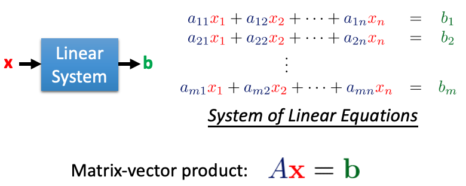
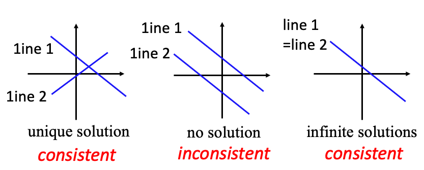
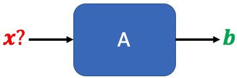
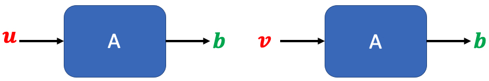
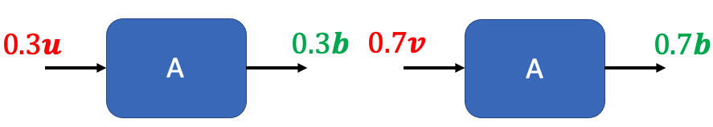
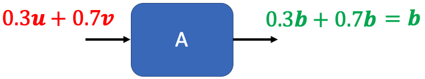
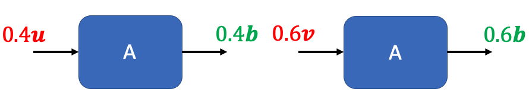
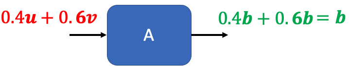

# Solution of System of Linear Equations（线性方程组的解）

## I. Review

给定$\color{blue}A$和$\color{green}{\mathbf{b}}$，求$\color{red}{\mathbf{x}}$ 

## II. The perspective of High School

### Example

**假设有下面的二元一次线性方程组：**
$$
\begin{matrix} {\color{Blue}{a_{11}}}{\color{Red}{x_1}} + {\color{Blue}{a_{12}}}{\color{Red}{x_2}} = {\color{Green}{b_1}} \dots \text{line 1} \\ {\color{Blue}{a_{21}}}{\color{Red}{x_1}} + {\color{Blue}{a_{22}}}{\color{Red}{x_2}} = {\color{Green}{b_2}} \dots \text{line 2} \end{matrix}
$$
**则有:**

## Properties: Only Unique and Infinite solutions

**如果一个System of Linear Equations有解，要么它只有唯一解，要么它有无穷多个解。**

**一旦可以找到两个solution，就可以找到无穷多个solutions**

### 证明

**假设有如下的System of Linear Equations：**

**如果我们能找到两个解$u$和$v$：**

**则根据Linear System的特性就可以有：**

**即：$0.3u+0.7v$也是它的一个解**

**同样可以有：**

**即：$0.4u+0.6v$也是它的一个解**

**以此类推，这个System of Linear Equations会有无穷多个解**

---

## III. The perspective of Linear Algebra

已知有${\color{blue}A}{\color{red}\mathbf{x}} = {\color{green}\mathbf{b}}$，给定${\color{blue}A}:{\color{green}m}\times{\color{red}n}$和${\color{green}\mathbf{b}} \in R^{\color{green}m}$，求${\color{red}\mathbf{x}} \in R^{\color{red}n}$ 

1. 判断是否有解：
   1. 条件1：如果${\color{green}\mathbf{b}}$是${\color{blue}A}$列向量的一个linear combination(线性组合)，则有解，反之无解
   2. 条件2：如果${\color{green}\mathbf{b}}$在${\color{blue}A}$列向量的span(扩展空间)里，则有解，反之无解
   3. 条件1等价于条件2
2. 判断是唯一解还是无穷解：
   1. 唯一解的条件：(下面三个条件是等价的)
      1. ${\color{blue}A}$列向量是独立的
      2. $Rank \ {\color{blue}A} = n$，即${\color{blue}A}$是满秩
      3. $Nullity \ {\color{blue}A} = 0$，即${\color{blue}A}$的零化度为0
   2. 无穷解的条件：(下面三个条件是等价的)
      1. ${\color{blue}A}$列向量是非独立的
      2. $Rank \ {\color{blue}A} < n$， 即${\color{blue}A}$不是满秩
      3. $Nullity \ {\color{blue}A} > 0$，即${\color{blue}A}$的零化度大于0