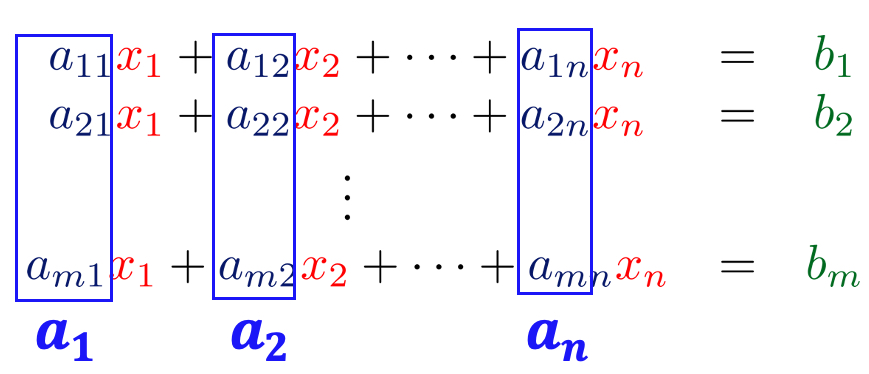
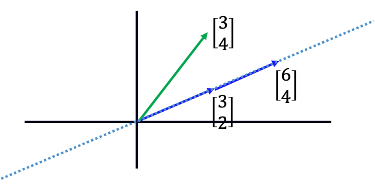
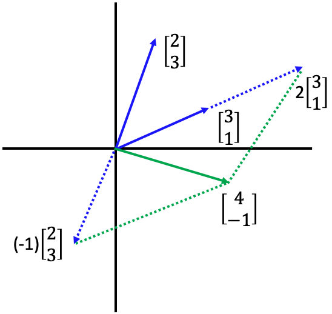
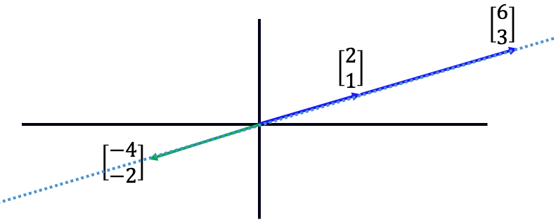
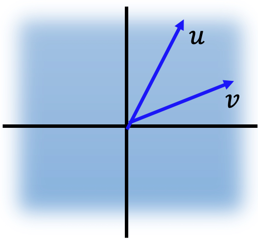

# Linear Combination（线性组合）

## I. Definition of Linear Combination

### 1.1 Definition

* 给定一组vector $\begin{Bmatrix} \mathbf{u_1}, \mathbf{u_2}, \dots , \mathbf{u_k} \end{Bmatrix}$
* 如果存在一组scalar $c_1, c_2, \dots, c_k$，使得：$\mathbf{v} = c_1 \mathbf{u_1} + c_2 \mathbf{u_2} + \dots + c_k \mathbf{u_k}$成立
  * 即$c_1, c_2, \dots, c_k$与$\begin{Bmatrix} \mathbf{u_1}, \mathbf{u_2}, \dots , \mathbf{u_k} \end{Bmatrix}$做weighted sum可以得一个新的vector $\mathbf{v}$
* 此时称，$\mathbf{v}$是$\begin{Bmatrix} \mathbf{u_1}, \mathbf{u_2}, \dots , \mathbf{u_k} \end{Bmatrix}$的一个linear combination
  * $c_1, c_2, \dots, c_k$是这个linear combination的coefficients

### 1.2 Example

* 给定一组vector：$\begin{Bmatrix} \begin{bmatrix} 1 \\ 1 \end{bmatrix}, \begin{bmatrix} 1 \\ 3 \end{bmatrix}, \begin{bmatrix} 1 \\ -1 \end{bmatrix} \end{Bmatrix}$
* 存在一组scalar $-3, 4, 1$，使得：$ -3 {\begin{bmatrix} 1 \\ 1 \end{bmatrix}} + 4 {\begin{bmatrix} 1 \\ 3 \end{bmatrix}} + {\begin{bmatrix} 1 \\ -1 \end{bmatrix}} = \begin{bmatrix} 2 \\ 8 \end{bmatrix}$
* 此时称，$\begin{bmatrix} 2 \\ 8 \end{bmatrix}$是$\begin{Bmatrix} \begin{bmatrix} 1 \\ 1 \end{bmatrix}, \begin{bmatrix} 1 \\ 3 \end{bmatrix}, \begin{bmatrix} 1 \\ -1 \end{bmatrix} \end{Bmatrix}$的一个linear combination
  * $-3, 4, 1$是这个linear combination的coefficients

## II. Reviewing Column Aspect

### 2.1 Column Aspect

* Vector set: $\color{blue}A = [\mathbf{a_1} \ \mathbf{a_2} \ \dots \ \mathbf{a_n}]$
* Coefficients: $\color{red}{\mathbf{x}} = \begin{bmatrix} x_1 \\ x_2 \\ \dots \\ x_n \end{bmatrix}$
* Linear Combination: ${\color{blue}A} {\color{red}{\mathbf{x}}} = {\color{red}{x_1}}{\color{blue}{a_1}} + {\color{red}{x_2}}{\color{blue}{a_2}} + \dots + {\color{red}{x_n}}{\color{blue}{a_n}}$  

###  2.2 System of Linear Equations v.s. Linear Combination

* 判断System of  linear equations $\color{blue}A {\color{red}{\mathbf{x}}} = {\color{green}{\mathbf{b}}}$ 是否有解，则意味着判断：
  * 判断其解集是否为非空（non empty）
  * 是否相容？
    * 相容（consistent）就是有解
    * 不相容（inconsistent）就是无解
* 等价于判断是否存在$\color{blue}A {\color{red}{\mathbf{x}}} = {\color{green}{\mathbf{b}}}  = {\color{red}{x_1}}{\color{blue}{a_1}} + {\color{red}{x_2}}{\color{blue}{a_2}} + \dots + {\color{red}{x_n}}{\color{blue}{a_n}}$，即${\color{green}{\mathbf{b}}}$是不是$\color{blue}A$列向量的linear combination 

### 2.3 Example

#### 2.3.1 Example 1

判断 $\begin{matrix} {\color{Blue}{3}}{\color{Red}{x_1}} + {\color{Blue}{6}}{\color{Red}{x_2}} = {\color{Green}{3}} \\ {\color{Blue}{2}}{\color{Red}{x_1}} + {\color{Blue}{4}}{\color{Red}{x_2}} = {\color{Green}{4}} \end{matrix}$ 是否有解。

* 根据表达式可得 $\color{blue}{A = \begin{bmatrix} 3 & 6 \\ 2 & 4 \end{bmatrix}}$， $\color{red}{{\mathbf{x}} = \begin{bmatrix} x_1 \\ x_2 \end{bmatrix}}$，$\color{green}{{\mathbf{b}} = \begin{bmatrix} 3 \\ 4 \end{bmatrix}}$

* 需要判断$\color{green} {\begin{bmatrix} 3 \\ 4 \end{bmatrix}}$是否是$\color{blue}{\begin{Bmatrix} \begin{bmatrix} 3 \\ 2 \end{bmatrix}, \begin{bmatrix} 6 \\ 4 \end{bmatrix} \end{Bmatrix}}$的linear combination

* 如图所示，显然$\color{green} \begin{bmatrix} 3 \\ 4 \end{bmatrix}$不是 $\color{blue}{\begin{Bmatrix} \begin{bmatrix} 3 \\ 2 \end{bmatrix}, \begin{bmatrix} 6 \\ 4 \end{bmatrix} \end{Bmatrix}}$的linear combination

  * 
  * $\color{blue} \begin{bmatrix} 3 \\ 2 \end{bmatrix}$与$\color{blue} \begin{bmatrix} 6 \\ 4 \end{bmatrix}$是parallel的
    * 因此 $\begin{Bmatrix} {\color{blue} \begin{bmatrix} 3 \\ 2 \end{bmatrix}, \begin{bmatrix} 6 \\ 4 \end{bmatrix} } \end{Bmatrix}$ 的linear combination只会出现在蓝色的虚线上
  * 所以该表达式无解

  

#### 2.3.2 Example 2

判断 $\begin{matrix} {\color{Blue}{2}}{\color{Red}{x_1}} + {\color{Blue}{3}}{\color{Red}{x_2}} = {\color{Green}{4}} \\ {\color{Blue}{3}}{\color{Red}{x_1}} + {\color{Blue}{1}}{\color{Red}{x_2}} = {\color{Green}{-1}} \end{matrix}$ 是否有解。

* 根据表达式可得 $\color{blue}A = \begin{bmatrix} 2 & 3 \\ 3 & 1 \end{bmatrix}$， $\color{red}{\mathbf{x}} = \begin{bmatrix} x_1 \\ x_2 \end{bmatrix}$，$\color{green}{\mathbf{b}} = \begin{bmatrix} 4 \\ -1 \end{bmatrix}$
* 需要判断$\color{green} \begin{bmatrix} 4 \\ -1 \end{bmatrix}$是否是$ \begin{Bmatrix} {\color{blue} \begin{bmatrix} 2 \\ 3 \end{bmatrix}, \begin{bmatrix} 3 \\ 1 \end{bmatrix} } \end{Bmatrix}$的linear combination
* 如图所示，显然$\color{green} \begin{bmatrix} 4 \\ -1 \end{bmatrix}$是 $\begin{Bmatrix} {\color{blue} \begin{bmatrix} 2 \\ 3 \end{bmatrix}, \begin{bmatrix} 3 \\ 1 \end{bmatrix} } \end{Bmatrix}$的linear combination
  * 
  * $\color{blue} \begin{bmatrix} 2 \\ 3 \end{bmatrix}$与$\color{blue} \begin{bmatrix} 3 \\ 1 \end{bmatrix}$是non-parallel的
    * 因此 $ \begin{Bmatrix} {\color{blue} \begin{bmatrix} 2 \\ 3 \end{bmatrix}, \begin{bmatrix} 3 \\ 1 \end{bmatrix} } \end{Bmatrix}$ 的linear combination可以覆盖整个二维空间 
  * 所以该表达式有解

#### 2.3.3 Example 3

判断 $\begin{matrix} {\color{Blue}{2}}{\color{Red}{x_1}} + {\color{Blue}{6}}{\color{Red}{x_2}} = {\color{Green}{-4}} \\ {\color{Blue}{1}}{\color{Red}{x_1}} + {\color{Blue}{3}}{\color{Red}{x_2}} = {\color{Green}{-2}} \end{matrix}$ 是否有解。

* 根据表达式可得 $\color{blue}A = \begin{bmatrix} 2 & 6 \\ 1 & 3 \end{bmatrix}$， $\color{red}{\mathbf{x}} = \begin{bmatrix} x_1 \\ x_2 \end{bmatrix}$，$\color{green}{\mathbf{b}} = \begin{bmatrix} -4 \\ -2 \end{bmatrix}$
* 需要判断$\color{green} \begin{bmatrix} -4 \\ -2 \end{bmatrix}$是否是$ \begin{Bmatrix} {\color{blue} \begin{bmatrix} 2 \\ 1 \end{bmatrix}, \begin{bmatrix} 6 \\ 3 \end{bmatrix} } \end{Bmatrix}$的linear combination
* 如图所示，显然$\color{green} \begin{bmatrix} -4 \\ -2 \end{bmatrix}$是$ \begin{Bmatrix} {\color{blue} \begin{bmatrix} 2 \\ 1 \end{bmatrix}, \begin{bmatrix} 6 \\ 3 \end{bmatrix} } \end{Bmatrix}$的linear combination
  * 
  * $\color{blue} \begin{bmatrix} 2 \\ 1 \end{bmatrix}$与$\color{blue} \begin{bmatrix} 6 \\ 3 \end{bmatrix}$是parallel的
    * 因此 $\begin{Bmatrix} {\color{blue} \begin{bmatrix} 2 \\ 1 \end{bmatrix}, \begin{bmatrix} 6 \\ 3 \end{bmatrix} } \end{Bmatrix}$ 的linear combination只会出现在蓝色的虚线上
    * 此时，$\color{green} \begin{bmatrix} -4 \\ -2 \end{bmatrix}$落在了蓝色的虚线上
  * 所以该表达式有解

### 2.4 扩展

1. 如果$\mathbf{v}$和$\mathbf{u}$是$\mathbf{R^2}$内任意两个non-parallel的vector，则$\mathbf{R^2}$内的所有vector都是$\mathbf{v}$和$\mathbf{u}$的linear combination

   * 如图所示，$\mathbf{v}$和$\mathbf{u}$是$\mathbf{R^2}$内的两个non-parallel的vector
   * non-parallel意味着：$\mathbf{v}$和$\mathbf{u}$都是nonzero vector（非零向量），且，$\mathbf{v} \neq c \mathbf{u}$
   * 

   * 注意：
     * 二维空间内，如果一个system of linear equations的矩阵A中两个vector是non-parallel，则必定有解
     * 反过来，二维空间内，如果一个system of linear equations有解，其矩阵A中两个vector不一定是non-parallel（例如，example 3）

2. 如果$\mathbf{v}$、$\mathbf{u}$和$\mathbf{w}$是$\mathbf{R^3}$内任意三个non-parallel的vector，此时$\mathbf{v}$、$\mathbf{u}$和$\mathbf{w}$的linear combination不一定能表达$\mathbf{R^3}$内的所有vector（除非保证$\mathbf{v}$、$\mathbf{u}$和$\mathbf{w}$不在同一个平面中）

