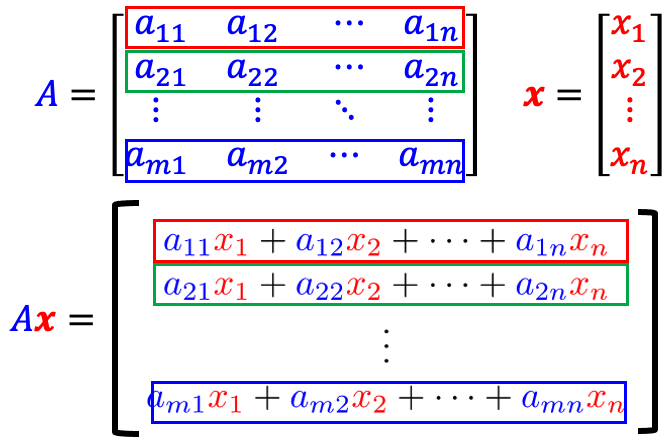
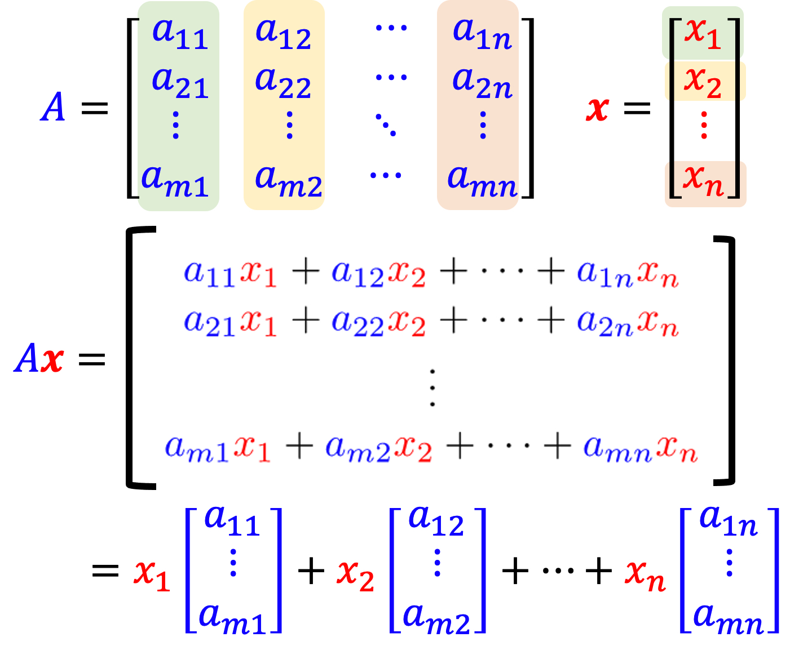
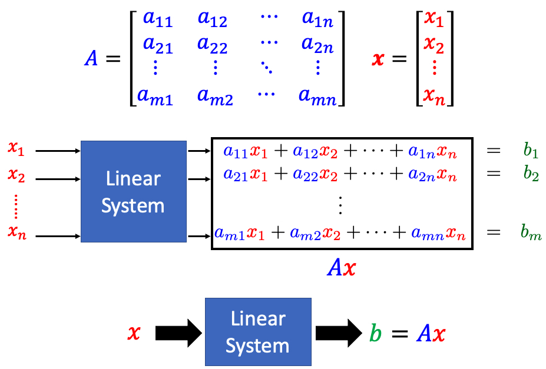
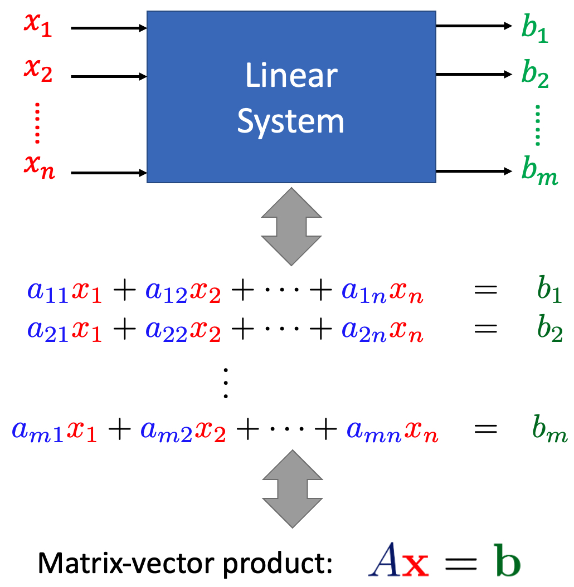
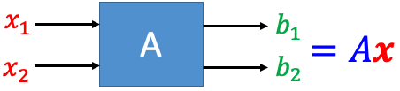
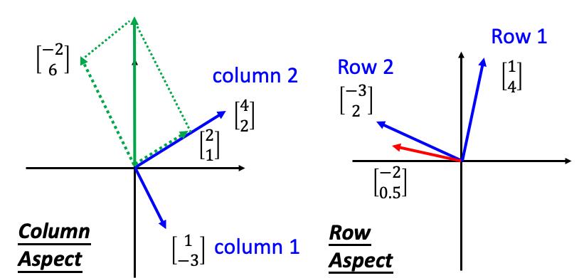
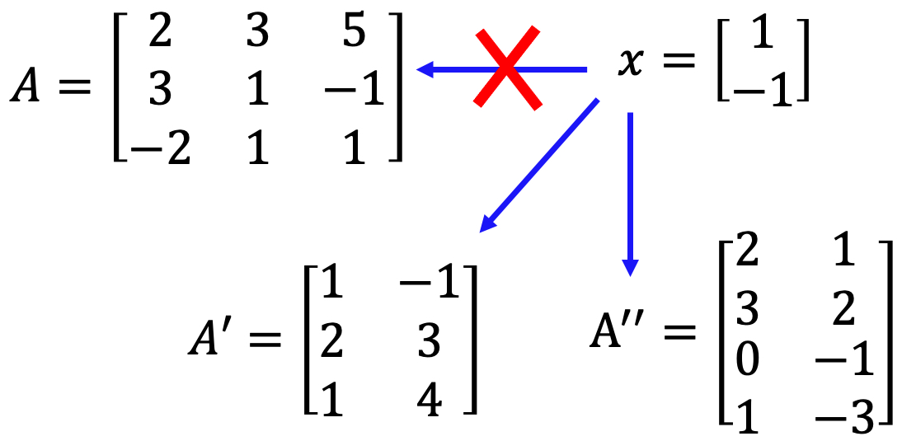
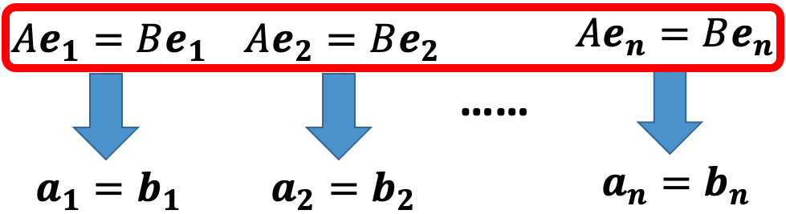

# Matrix-Vector Product（矩阵-向量乘积）

## Definition

$$
A=\begin{bmatrix}a_{11} & a_{12} & \dots & a_{1n} \\ a_{21} & a_{22} & \dots & a_{2n} \\ \vdots & \vdots & \vdots & \vdots \\ a_{m1} & a_{m2} & \dots & a_{mn}\end{bmatrix}
$$
$$
\mathbf{x}= \begin{bmatrix}x_1 \\ x_2 \\ \dots \\ x_n\end{bmatrix}
$$

$$
A\mathbf{x} = \begin{bmatrix}
 {\color{Blue}{a_{11}}}{\color{Red}{x_1}}+{\color{Blue}{a_{12}}}{\color{Red}{x_2}}+\dots+{\color{Blue}{a_{1n}}}{\color{Red}{x_n}}  \\
 {\color{Blue}{a_{21}}}{\color{Red}{x_1}}+{\color{Blue}{a_{22}}}{\color{Red}{x_2}}+\dots+{\color{Blue}{a_{2n}}}{\color{Red}{x_n}} \\
 \vdots \\
{\color{Blue}{a_{m1}}}{\color{Red}{x_1}}+{\color{Blue}{a_{m2}}}{\color{Red}{x_2}}+\dots+{\color{Blue}{a_{mn}}}{\color{Red}{x_n}}
\end{bmatrix}
$$

## Row Aspect

**Inner Product with Rows（向量与矩阵中行的内积）**

### Example

$ A=\begin{bmatrix}1 & 2 & 3 \\ 4 & 5 & 6\end{bmatrix} $ $\mathbf{x}=\begin{bmatrix} 1 \\ 2 \\ 3 \end{bmatrix}$ $ \Rightarrow A\mathbf{x}=\begin{bmatrix} 1 \times 1+ 2\times 2 + 3 \times 3 \\ 4 \times 1 + 5 \times 2 + 6 \times 3 \end{bmatrix}=\begin{bmatrix} 14 \\ 32 \end{bmatrix}$

## Column Aspect

**Weighted Sum of Columns（矩阵列的权重和）**

### Example

$ A=\begin{bmatrix}1 & 2 & 3 \\ 4 & 5 & 6\end{bmatrix} $ $\mathbf{x}=\begin{bmatrix} 1 \\ 2 \\ 3 \end{bmatrix}$ $\Rightarrow A\mathbf{x}=1 \times \begin{bmatrix} 1 \\ 4\end{bmatrix} + 2 \times \begin{bmatrix} 2 \\ 5\end{bmatrix} + 3 \times \begin{bmatrix} 3 \\ 6\end{bmatrix} = \begin{bmatrix} 14 \\ 32\end{bmatrix}$

## The matrix A represents the system

**A Linear System is a matrix-vector production**

*Input: X*

*Output: b*

$$
A\mathbf{x} = \begin{bmatrix}
 {\color{Blue}{a_{11}}}{\color{Red}{x_1}}+{\color{Blue}{a_{12}}}{\color{Red}{x_2}}+\dots+{\color{Blue}{a_{1n}}}{\color{Red}{x_n}}  \\
 {\color{Blue}{a_{21}}}{\color{Red}{x_1}}+{\color{Blue}{a_{22}}}{\color{Red}{x_2}}+\dots+{\color{Blue}{a_{2n}}}{\color{Red}{x_n}} \\
 \vdots \\
{\color{Blue}{a_{m1}}}{\color{Red}{x_1}}+{\color{Blue}{a_{m2}}}{\color{Red}{x_2}}+\dots+{\color{Blue}{a_{mn}}}{\color{Red}{x_n}}
\end{bmatrix}=\mathbf{\color{Green}{b}}
$$

### Relations

### Example

$$
\begin{matrix} {\color{Red}{x_1}} + {\color{Blue}{4}}{\color{Red}{x_2}} = {\color{Green}{b_1}} \\ {\color{Blue}{-3}}{\color{Red}{x_1}} + {\color{Blue}{2}}{\color{Red}{x_2}} = {\color{Green}{b_2}} \end{matrix} \Rightarrow \color{Blue}{A=\begin{bmatrix} 1 & 4 \\ -3 & 2  \end{bmatrix}}
$$

假设$x_1=-2, x_2=0.5$

## Properties

### Condition

**The size of matrix and vector should be matched.**

The number of the matrix's columns should equal the number of  the vector's rows.

### 特性

如果$A$，$B$都是$m \times n$的matrix，$\mathbf{u}$，$\mathbf{v}$是两个$R^n$中的vector，$c$是两个scalar，则有:

* $A(\mathbf{u}+\mathbf{v})=A\mathbf{u}+A\mathbf{v}$
* $A(c\mathbf{u})=c(A\mathbf{u})=(cA)\mathbf{u}$
* $(A+B)\mathbf{u}=A\mathbf{u}+B\mathbf{u}$
* $A\mathbf{0}=\mathbf{0}$
* $\mathbf{0}\mathbf{v}=\mathbf{0}$
* $I_n \mathbf{v}=\mathbf{v}$

$A$，$B$都是$m \times n$的matrix。如果对所有的$\mathbf{w} \in R^n$都有$A\mathbf{w}=B\mathbf{w}$，那么$A=B$。

证明：

1. $A$可以表达为n个列向量的组合，即$A=[\mathbf{a_1} \quad \mathbf{a_2} \dots \mathbf{a_n}]$

2. $B$可以表达为n个列向量的组合，即$B=[\mathbf{b_1} \quad \mathbf{b_2} \dots \mathbf{b_n}]$

3. 因为：

   1. $A\mathbf{e_1}=\mathbf{a_1} \quad A\mathbf{e_2}=\mathbf{a_2} \dots A\mathbf{e_n}=\mathbf{a_n}$
   2. $B\mathbf{e_1}=\mathbf{b_1} \quad B\mathbf{e_2}=\mathbf{b_2} \dots B\mathbf{e_n}=\mathbf{b_n}$

4. 如果对所有的$\mathbf{w} \in R^n$都有$A\mathbf{w}=B\mathbf{w}$，则有：

   1. $A\mathbf{e_1}=B\mathbf{e_1} \quad A\mathbf{e_2}=B\mathbf{e_2} \dots A\mathbf{e_n}=B\mathbf{e_n}$
   2. $\mathbf{a_1}=\mathbf{b_1} \quad \mathbf{a_2}=\mathbf{b_2} \dots \mathbf{a_n}=\mathbf{b_n}$
   3. 

5. 所以可以得到$A=B$

   

