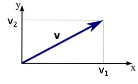

# Vector

## Vectors(向量/矢量)
1. vector是数的集合（高中的定义）
    * eg: $\mathbf{v}=\begin{bmatrix}1\\ 2\\ 3\end{bmatrix} $
2. component是vector的内部元素，以向量加下标索引
    * eg: $\mathbf{v}_1=1,\, \mathbf{v}_2=2,\, \mathbf{v}_3=3$
3. component数量小于4的vector都可以进行visualization
    * eg: 

## Vector Set(向量集)
1. vector set是vector的集合
eg: $\begin{Bmatrix} \begin{bmatrix} 1\\ 2\\ 3\end{bmatrix}, \begin{bmatrix}4\\ 5\\ 6\end{bmatrix}, \begin{bmatrix}7\\ 8\\ 9\end{bmatrix}\end{Bmatrix} $
2. 一个vector set中可以包含无限多个vector
eg: $L=\begin{Bmatrix} \begin{bmatrix}x_1\\ x_2\end{bmatrix}:x_1+x_2=1\end{Bmatrix} $可包含无限多$\begin{bmatrix}1\\ 0\end{bmatrix},\begin{bmatrix}0\\ 1\end{bmatrix},\begin{bmatrix}0.8\\ 0.2\end{bmatrix},\begin{bmatrix}0.2\\ 0.8\end{bmatrix},\dots$
3. $R^n$是所有n维vector的集合
   
## Vector Calculation
1. Scalar Multiplication（数乘）
    * $\mathbf{v} = \begin{bmatrix}v_1\\ v_2\end{bmatrix} \Rightarrow  c\mathbf{v} = \begin{bmatrix}cv_1\\ cv_2\end{bmatrix}  $
2. Vector Addition（向量加法）
    * $\begin{bmatrix}a_1\\ a_2\end{bmatrix}+\begin{bmatrix}b_1\\ b_2\end{bmatrix}=\begin{bmatrix}a_1+b_1\\ a_2+b_2\end{bmatrix}$

## Properties of Vector（真实的向量定义）
满足一下8个特征的object就是vector

给定$R^n$中的任意vector：$\mathbf{v},\mathbf{u},\mathbf{w}$
给定任意scalar: $a$和$b$
* $\mathbf{u}+\mathbf{v}=\mathbf{v}+\mathbf{u}$
* $\left ( \mathbf{u}+\mathbf{v} \right ) +\mathbf{w}=\mathbf{u}+\left ( \mathbf{v}+\mathbf{w} \right )$
* $R^n$中一定存在$\mathbf{0}$-vector($\mathbf{0}=\begin{bmatrix}0\\ \dots\\ 0\end{bmatrix}$)，使得$\mathbf{0}+\mathbf{u}=\mathbf{u}$
* $R^n$中一定存在$\mathbf{u}'$-vector，使得$\mathbf{u}'+\mathbf{u}=\mathbf{0}$
* $1\mathbf{u}=\mathbf{u}$
* $\left ( ab \right ) \mathbf{u}=a\left ( b\mathbf{u} \right ) $
* $a\left ( \mathbf{u}+\mathbf{v} \right ) =a\mathbf{u}+a\mathbf{v}$
* $\left ( a+b \right )\mathbf{u} =a\mathbf{u}+b\mathbf{u}$
